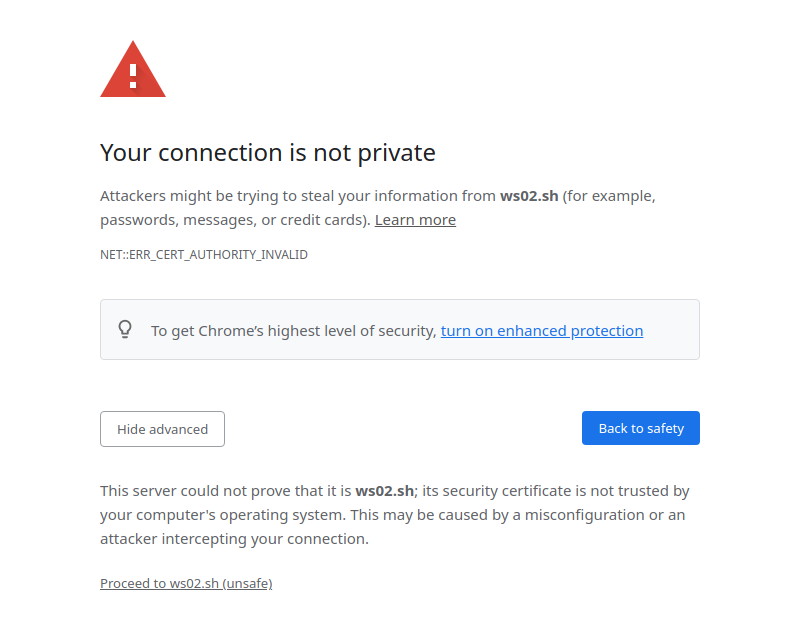
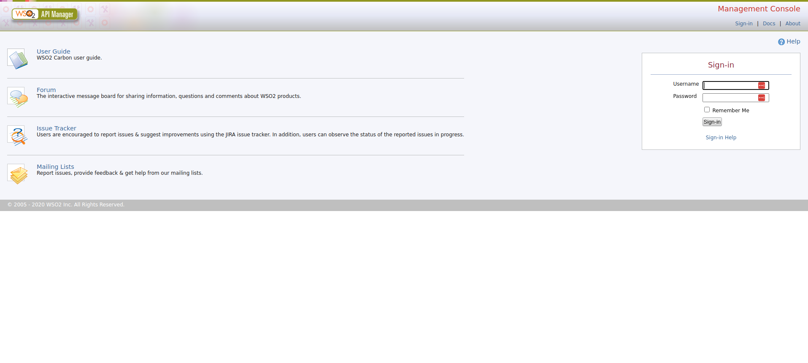
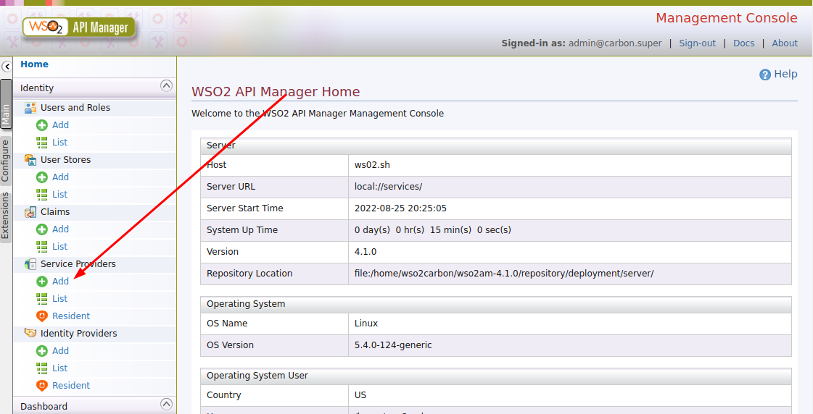
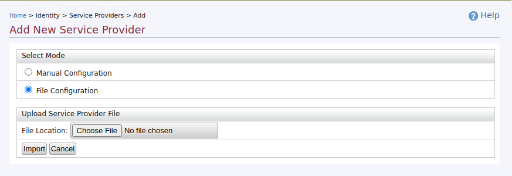
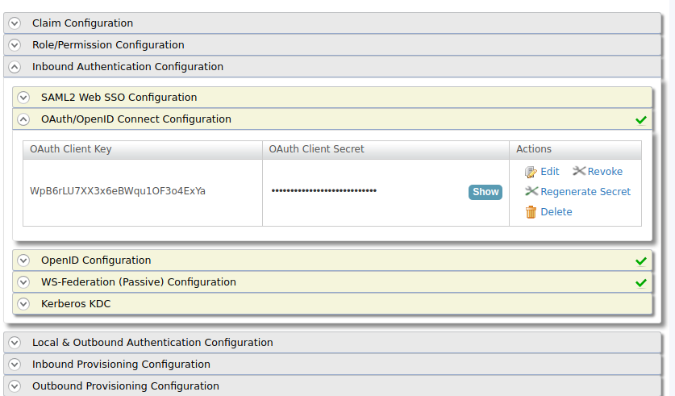

# 1 - Integração com WS02

A configuração deste ambiente de desenvolvimento será feita utilizando containers docker e imagens do WS02 disponíveis no [Docker Hub]([Docker Hub](https://hub.docker.com/r/wso2/wso2am)).

## Requisitos

- Docker 20.10 ou superior

- [Imagem do WS02]([Docker Hub](https://hub.docker.com/r/wso2/wso2am))

- Python 3.8+

## Criando o ambiente de desenvolvimento

Nesta instação, o container contendo o servidor do WS02 local terá o nome de ``` ws02.sh```.

### Instalação do WS02

Renomeie o arquivo em *example.toml* para *deployment.toml*

Em seguida, execute:

```shell
docker run -it -p 8280:8280 -p 8243:8243 -p 9443:9443 -v $(pwd)/deployment.toml:/home/wso2carbon/wso2am-4.1.0/repository/conf/deployment.toml --name ws02.sh wso2/wso2am:4.1.0
```

Edite o arquivo ```/etc/hosts```, adicione a seguinte linha:

```shell
127.0.0.1 ws02.sh
```

Agora, acesse https://ws02.sh:9443/carbon no seu Browser. Aceite acessar o site mesmo com erro de SSL. 



A senha padrão é **admin** e senha também **admin**.



Agora, acesse o menu **Service Providers** Importe o arquivo sp.example.xml disponível na pasta **docs**.  





Agora, você precisa configurar a sua URL de callback. Esta URL será para onde o WS02 redirecionará o usuário quando o ele autenticar corretamente no WS02.

Acesse:  Home  > Identity  > Service Providers  > List . Na listagem que aparecerá, clique em "Edit". Navegue até a configuração do cliente e clique em "Edit", como mostrado a seguir.



Na URL de callback você poderá informar uma única URL ou váriar utilizar uma pressão regular. Vejo um exemplo de duas URLs de callbacks.

```shell
regexp=(http://urldomeuservidor1/logincallback|http://urldomeuservidor2/logincallback)
```

Pronto, o serviço do WS02 local já está pronto para receber conexões. Sempre que precisar, inicie o serviço de WS02 com o comando:

```shell
docker container start ws02.sh
```

### Autenticando no WS02 com Python.

Instale no seu servidor a biblioteca pyoidc:

```shell
pip install oic
```

Abaixo, segue um exemplo de código utilizando Fast Api com a completa autenticação do usuário. Este script utiliza variáveis de ambiente definidas em um arquivo .env ou exportadas manualmente via console. 

Exemplo de arquivo .env:

```shell
WS02_ISSUER=https://ws02.sh:9443
URL_FRONTEND=URL_DO_SEU_FRONTEND
URL_BACKEND=URL_DO_SEU_BACKEND
WS02_CLIENT_ID=SEU_CLIENT_ID
WS02_CLIENT_SECRET=SEU_CLIENT_SECRET
```

Exemplo de autenticação com [Fast API.](https://fastapi.tiangolo.com/)

```python
from fastapi import APIRouter, Depends, status, HTTPException, Request
from fastapi.security import OAuth2PasswordRequestForm
from ..repository import schemas, database, models
from ..security.hashing import Hash
from ..security import token
import oic
from oic.oic.message import ProviderConfigurationResponse
from oic.oic import Client
from oic.utils.authn.client import CLIENT_AUTHN_METHOD
from oic.oic.message import RegistrationResponse
from oic import rndstr
import warnings
import contextlib
from oic.oic.message import AuthorizationResponse

import requests
from urllib3.exceptions import InsecureRequestWarning
from fastapi.responses import RedirectResponse
import os
router = APIRouter(tags=['Authentication'])
inner_state = rndstr()
nonce = rndstr()
client = Client(client_authn_method=CLIENT_AUTHN_METHOD)


@contextlib.contextmanager
def no_ssl_verification():
    opened_adapters = set()

    old_merge_environment_settings = requests.Session.merge_environment_settings

    def merge_environment_settings(self, url, proxies, stream, verify, cert):
        # Verification happens only once per connection so we need to close
        # all the opened adapters once we're done. Otherwise, the effects of
        # verify=False persist beyond the end of this context manager.
        opened_adapters.add(self.get_adapter(url))

        settings = old_merge_environment_settings(self, url, proxies, stream, verify, cert)
        settings['verify'] = False

        return settings

    requests.Session.merge_environment_settings = merge_environment_settings

    try:
        with warnings.catch_warnings():
            warnings.simplefilter('ignore', InsecureRequestWarning)
            yield
    finally:
        requests.Session.merge_environment_settings = old_merge_environment_settings

        for adapter in opened_adapters:
            try:
                adapter.close()
            except:
                pass

def get_login_url():
    # Informações padrões sobre os end-points do Provedor OpenID (OP - WSO2 IS)
    # Estas informações vem de um arquivo .env
    # no nosso exemplo, o WS02_ISSUER=https://ws02.sh:9443
    WS02_ISSUER = os.getenv('WS02_ISSUER')
    info_issuer = {}

    with no_ssl_verification(): 
        info_issuer = requests.get("{}/oauth2/oidcdiscovery/.well-known/openid-configuration".format (WS02_ISSUER)).json()

    op_info = ProviderConfigurationResponse( 
        version ="1.0", 
        issuer = info_issuer["issuer"],
        authorization_endpoint = info_issuer["authorization_endpoint"],
        token_endpoint = info_issuer["token_endpoint"],
        jwks_uri = info_issuer["jwks_uri"],
        userinfo_endpoint = info_issuer["userinfo_endpoint"],
        revocation_endpoint = info_issuer["revocation_endpoint"],
        introspection_endpoint= info_issuer["introspection_endpoint"],
        end_session_endpoint = info_issuer["end_session_endpoint"],
        srv_discovery_url = "{}/oauth2/oidcdiscovery/.well-known/openid-configuration".format (WS02_ISSUER),
   
    )

    client.handle_provider_config(op_info, op_info['issuer'])

    info = {
        "client_id": os.getenv('WS02_CLIENT_ID'), 
        "client_secret": os.getenv('WS02_CLIENT_SECRET')
    }

    client_reg = RegistrationResponse(**info)

    client.store_registration_info(client_reg)

    args = {
        "enabled": True,
        "authority": "{}/oauth2/oidcdiscovery/".format (WS02_ISSUER),
        "post_logout_redirect_uri": "{}/login/0".format (os.getenv ('URL_FRONTEND')),
        "client_id": client.client_id,
        "response_type": ['code'], # Determina o fluxo de autorização OAuth 2.0 que será utilizado
        "scope": ["openid profile email"], #Por padrão é inserido 'openid', mas também pode ser inserido informações a qual deseja ter do usuário, como exemplo, email.
        "nonce": nonce, #É um valor de string usado para associar uma sessão de cliente a um token de ID e para mitigar ataques de repetição
        "redirect_uri": ['{}/logincallback'.format (os.getenv ('URL_BACKEND'))], #URL que o Provedor OpenID deve retornar após autenticação ser realizada
        "state": inner_state, #É utilizado para controlar as respostas às solicitações pendentes
    
    }

    auth_req = client.construct_AuthorizationRequest(request_args=args)
    return auth_req.request(client.authorization_endpoint)


@router.get('/authws02')
def ws02(db=Depends(database.get_db)):
    return RedirectResponse (get_login_url())
    
@router.get('/logoutcallback')
def logout():
    return RedirectResponse (client.end_session_endpoint)

#Rota que trata informações retornadas pela provedor OpenID (OP - WSO2 IS)
@router.get('/logincallback')
def callback(request: Request, db=Depends(database.get_db)):
    params = request.query_params
    
    aresp = client.parse_response(AuthorizationResponse, info=str(params), sformat="urlencoded")

    assert inner_state == aresp['state']   #Verifica se o state enviado na solicitação de autenticação é o mesmo retornado pelo Provedor Open ID (OP - WSO2 IS)

    with no_ssl_verification():        
        # Utiliza o Code Grant Type retornado pelo OP para solicitar ao OP o Access Token e ID Token
        args = {"code": aresp['code']}
        resp = client.do_access_token_request(state=aresp['state'], 
                                            request_args=args, 
                                            authn_method="client_secret_basic")

    if(resp["access_token"]!= ""):
        with no_ssl_verification():
            userinfo = client.do_user_info_request(access_token=resp["access_token"], scope='profile')
           
            # verifica se o usuário já está banco
            user = db.users.find_one({'email': userinfo['email']})

            if user:
                # execute aqui a sua lógica para redirecionar o 
                # já logado para a sua tela inicial
            else:
                # primeira vez que este usuário acessa a aplicação
                # insira suas informações no banco de dados
                new_user = schemas.User(
                name=userinfo['given_name'], 
                email=userinfo['email'])
            
            new_user = db.users.insert_one(new_user.dict(by_alias=True))

            # redirecione e/ou retorne do usuário logado
    
    else:
        return "ERRO DE AUTENTICAÇÃO"

```

### Testando em Produção e Homologação

Para testar sua aplicação em homologação e/ou produção haverá a necessidade de configurar apenas as variáveis de ambiente (Secret KEY e Secret ID do cliente) e a correta URL de callback no servidor de WS02 de produção, no caso do MPMG será https://sso.gsi.mpmg.mp.br .


